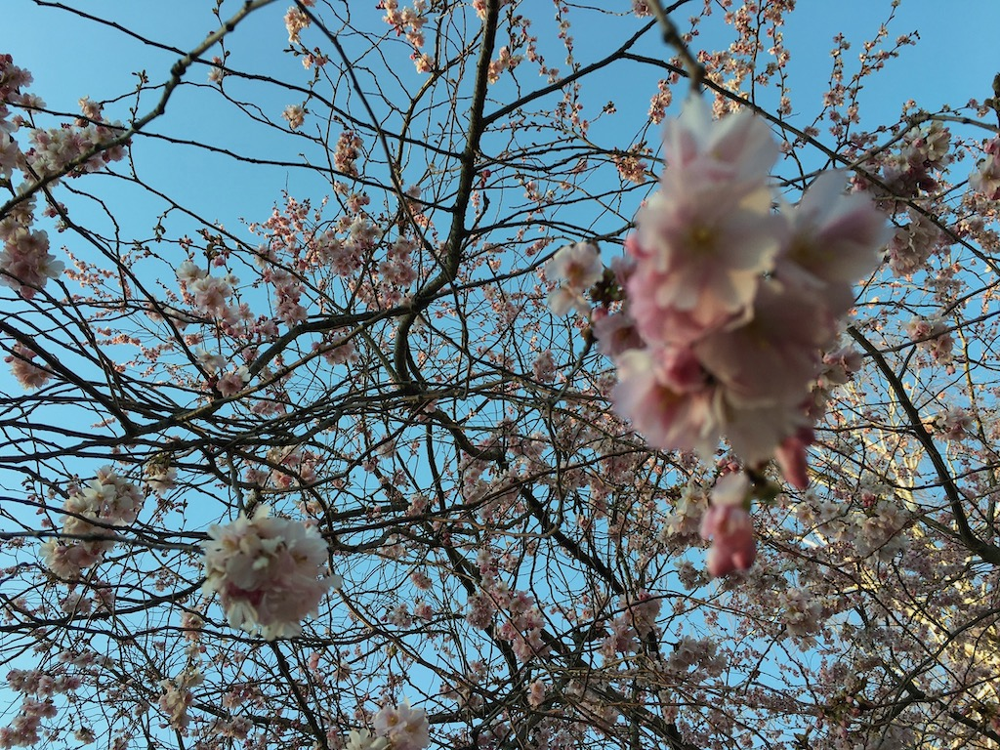

ML-V&L HT18 and onwards, Machine Leanring for Vision and Language, 7.5 HEC, Maskininlärningsmetoder för datorseende och språkteknologi, 7,5hp, part of [Doctoral Degree in Computational
Linguistics](https://flov.gu.se/digitalAssets/1605/1605989_asp-fd-datalingvistik-2016ver2.pdf).

The course focuses on machine learning/deep learning models and techniques such as Recurrent Neural Networks (RNNs), Long-Short Term Memory Networks (LSTMs), Convolutional Neural Networks (ConvNets), Neural Auto-Encoders, Memory Networks, and others applied to computational modeling of natural language and images, and other sensory information. 

Theoretically, it examines how machine learning approaches address topics such as multi-modal grounded representations of meaning, representing and resolving semantic ambiguity, attention and salience, perception and dialogue interaction, natural language interpretation, natural language generation, natural language reasoning and inference, and collection of perceptual and linguistic data. 

Practically, the course overviews contemporary computer vision and natural language processing tasks such as generating image and video descriptions, visual question answering, image retrieval using text queries, aligning images and text in large data collections, image generation from textual descriptions, and others.

Course prerequisites:

  - General admission requirements for a doctoral degree in Computational Linguistics or equivalent.
 
 In order to follow the course, the participants should at least have experience with one or several of the following fields at masters level:
 
 Students are expected to have a knowledge of (i) practical programming, for example in Python, (ii) natural language processing, and (iii) machine/deep learning, or equivalent.
 
  - Practical programming, for example in Python
  - Natural language processing
  - Machine/deep learning
  - or equivalent skills and knowledge.

Course syllabus

  - [In English](./documents/course-plan-ml-vl.pdf)

## Requirements

Please read [this document](../requirements.md) and talk to Simon.

## Lecturers

  - [Simon Dobnik](https://clasp.gu.se/about/people/simon-dobnik) (course organiser), office hours: by appointment

## Course literature

For a list of suggested readings please see [here](https://gu-clasp.github.io/language-and-perception/meetings/). Individual readings will be suggested for each meeting.

## Schedule and course materials

  - Topics will appear here
