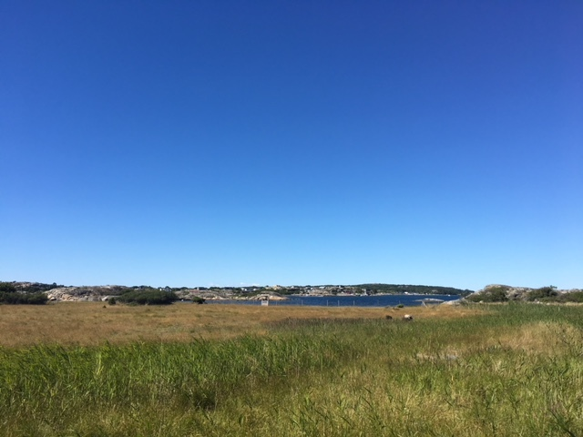

ROM HT18, Representations of meaning, 7.5 HEC, Representationer av
språklig betydelse, 7,5hp, part of [Doctoral Degree in Computational
Linguistics](https://flov.gu.se/digitalAssets/1605/1605989_asp-fd-datalingvistik-2016ver2.pdf).

The course gives a survey of theory and computational implementations
of representing and reasoning with meaning in natural languages from
cognitive, linguistic and computational perspective. We will look at
formal theories and computational implementations to model-theoretic
semantics (lambda calculus), situated and grounded representations of
meaning, semantic grammars (CCG, dependency grammar), distributional
representations of lexical meaning and its compositional extensions,
approaches to unsupervised machine learning of linguistic
representations, and others. An emphasis of the course will be (i) on
the nature of representations, (ii) how they satisfy the notion of
compositionality, (iii) how they are used in inference or reasoning
and (iv) what natural language processing applications are they useful
for.

Course prerequisites:

  - General admission requirements for a doctoral degree in
    Computational Linguistics or equivalent.

In order to follow the course, the participants should at least have
experience with one or several of the following fields at masters
level:

  - Formal semantics and pragmatics
  - Natural language processing
  - Computational semantics
  - Machine learning
  - or equivalent skills and knowledge.

Course syllabus

  - [In Swedish](https://flov.gu.se/digitalAssets/1578/1578778_representationer-av-spr--klig-betydelse--7-5-hp.pdf)

## Requirements

Please read [this document](../requirements.md) and talk to Simon.

## Lecturers

  - [Simon Dobnik](https://clasp.gu.se/about/people/simon-dobnik) (course organiser), office hours: by appointment

## Course literature

For a list of suggested readings please see [here](reading-list.pdf). Individual readings will be suggested for each meeting.

## Schedule and course materials

  - **Probabilistic semantics and pragmatics**
  	* 2020-05-15, Zoom
	* Goodman, N. D., & Frank, M. C. (2016). [Pragmatic Language Interpretation as Probabilistic Inference. In Trends in Cognitive Sciences.](http://langcog.stanford.edu/papers_new/goodman-2016-underrev.pdf) paper (recommended by Bill) 2020-05-15
	* Bill (presenter), Vlad, Mehdi, Nikolai, Robin, Staffan, Ellen, Simon
  - **Structure learning**
  	* 2020-04-03, Zoom
	* Tai, Kai & Socher, Richard & Manning, Christoper. (2015). [Improved Semantic Representations From Tree-Structured Long Short-Term Memory Networks.](https://arxiv.org/abs/1503.00075) 1. 10.3115/v1/P15-1150. 
	* Axel (presenter), Robin, Tewodros, Bill, Maryam, and Simon (**check**)

  - **Meaning representations**
	* 2020-03-06 10-12 Humanisten
	* Anonymous. [Climbing towards NLU: On meaning, form, and understanding in the age of data.](https://openreview.net/forum?id=GKTvAcb12b) OpenReview Preprint, anonymous preprint under review, January 26 2020.
	* Mehdi (presenter), Robin, Tewodros, Stergios, Adam, Axel and Simon

  - **Vector spaces and lexical meaning**
	* 2019-10-08 15-17 Dicksonsgatan 4
	* I. Vulić and N. Mrkšić. [Specialising word vectors for lexical entailment.](http://aclweb.org/anthology/N18-1103) In Proceedings of the 2018 Conference of the North American Chapter of the Association for Computational Linguistics: Human Language Technologies, Volume 1 (Long Papers), pages 1134–1145. Association for Computational Linguistics, 2018
	* Bill (presenter), Vlad and Mehdi

  - **Meaning in interaction**
	* 2019-10-19 13-15 Dicksonsgatan 4
	* W. Monroe, R. X. D. Hawkins, N. D. Goodman, and C. Potts. [Colors in context: A pragmatic neural model for grounded language understanding.](https://transacl.org/ojs/index.php/tacl/article/view/1142) Transactions of the Association for Computational Linguistics, 5:325–338, 2017.
	* Mehdi (presenter), Felix, Bill, Vlad, Sylvie

  - **Language models and meaning representations**
	*  2019-11-02 13-15 Olof Wijksgatan 6 T340
	* A. Conneau, G. Kruszewski, G. Lample, L. Barrault, and M. Baroni. [What you can cram into a single vector: Probing sentence embeddings for linguistic properties.](https://arxiv.org/pdf/1805.01070.pdf%202018-11-02) arXiv, arXiv:1805.01070 [cs.CL], 2018. 
	* Bill (presenter), Mehdi, Felix

  - **Multi-modal representations of concepts**
	*  2019-11-16 10-12 Dicksonsgatan 4
	* B. Landau and R. Jackendoff. [“what” and “where” in spatial language and spatial cognition.](https://doi.org/10.1017/S0140525X00029733) Behavioral and Brain Sciences, 16(2):217–238, 255–265, 1993. Background: B. Landau. Update on “what” and “where” in spatial language: A new division of labor for spatial terms. Cognitive Science, 41(2):321–350, 2016. 
	* Mehdi (presenter), Vlad, Bill

  - **Classification of semantic relations: prepositions**
	* 2019-12-06 13-15 Dicksonsgatan 4
	* Schneider, Nathan, Jena D. Hwang, Vivek Srikumar, Jakob Prange, Austin Blodgett, Sarah R. Moeller, Aviram Stern, Adi Bitan, and Omri Abend. [Comprehensive Supersense Disambiguation of English Prepositions and Possessives.](http://arxiv.org/abs/1805.04905) ArXiv:1805.04905 [Cs], May 13, 2018.
	* Bill (presenter), Mehdi and Felix 

  - **Interpretation of learned representations**
	* 2019-02-22 10-12 Dicksonsgatan 4
	* Li, J., Chen, X., Hovy, E., & Jurafsky, D. (2016). Visualizing and Understanding Neural Models in NLP. In Proceedings of NAACL-HLT (pp. 681-691).
	* Felix (presenter), Mehdi, Robin, Bill and Simon

  - **Embeddings beyond words**
	* 2019-03-05 10-12 Dicksonsgatan 4
	* Pragst, Louisa, et al. On the Vector Representation of Utterances in Dialogue Context. Proceedings of the Eleventh International Conference on Language Resources and Evaluation (LREC-2018), European Language Resource Association, 2018.
	* Bill (presenter), Robin, Felix and Simon

## Topics for individual readings

You can find some topics for individual reading [here](readings.md).
