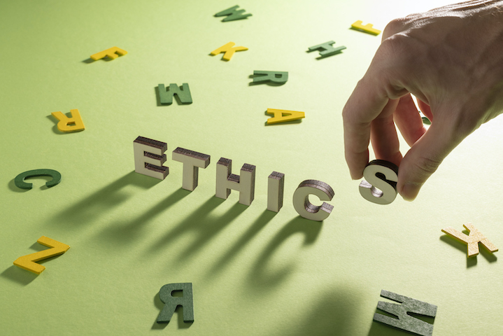

Organied by Stockholm, Uppsala and Umeå interest group in ethics for NLP

* Date: 23rd January 2024
* Location: Humanisten, [Department of Pholosophy, Linguistics and Theory of Science (FLoV)](https://www.gu.se/flov/om-oss/kontakt), University of Gothenburg, room J335
* Address: Renströmsgatan 6, floor 3
* Room: J335

### Workshop description

AI tasks related to modelling human language and that focus on decision making (such as identification of patient diagnoses and driving) have developed substantially over the last several years. In many areas it has been claimed that AI learning from data alone has achieved human-like performance, sometimes even better, but due to the nature of these models it is very hard to inspect directly what such models have learned. Instead, we can only observe their performance, which might be biased in one or more ways, and which has societal and environmental implications.

Language technology (also known as computational linguistics or natural language processing) is an interdisciplinary field between linguistics, psychology, cognitive science and computer science that deals with building computational models which can behave as if they understand natural language. Due to the aforementioned developments, a need has been identified by developers, researchers and teachers of language technology that ethical issues related to data collection, training and usage of such models in various real-life applications should also be addressed. We should equip  ourselves as researchers, teachers and students with understanding about the impacts of using such technology or to promote ethically-aware research and utilisation.

Intended participants are researchers, university teachers, masters and PhD students from diverse backgrounds that deal with ethical questions related to development and applications of language technology (language technology and related fields such as computer vision and social robotics, machine learning, pshilosophy, medicine, law, media, politics, philosophy etc). We foresee an interactive workshop with plenty of time for discussion, complemented with invited talks and presentations of on-going or completed research. Participants are also encouraged to submit posters of extended abstracts (and other materials) that will be shared with others during the workshop and/or presented as posters.

The workshop represents the first forum following the discussions at several Swedish language technology ämnesdagar. Topics that have been addressed there are biases in training data, biases in computational models, personal integrity (anonymisation and pseudonymisation of data), intellectual property rights, using language technology tools to detect non-ethical language use, utilising language technology in under-resourced domains and communities (e.g. minority languages), legal aspects of using language technology, philosophical questions and others. The purpose of the workshop is to further discuss these points from the research perspective and later develop as a short (e.g. 2.5 hec) online course for students of language technology and related fields at the participating sites, as well as general public interested in this area.

### Invited speakers

* [Kristina Knaving](https://www.ri.se/en/person/kristina-knaving), RISE
* [Juan Carlos Nieves](https://www.umu.se/personal/juan-carlos-nieves/), Umeå University

### Submissions

Submissions should follow [the ACL formatting template](https://2023.aclweb.org/calls/style_and_formatting/), should be in English and contain full contact information of the presenter(s). Authors are also encouraged to submit any other information that they would like to discuss and share about this topic, in particular if it is relevant for the preperation of the course.

Please upload your submissions (zipped in a file name.surname.zip) with your full contact details [here](https://linux.dobnik.net/cloud/s/dwn7nmY68aEjatK).

### Important dates

* Submission of extended abstracts: 1 December 2023
* Notification of acceptance: 22 December
* Registration: 9 January 2024

All deadlines are 11:59PM UTC-12:00 ("anywhere on Earth").

### Registration

Please register for the workshop using the following link (coming soon)

Because of its interactive nature, the workshop will be on-site only. However, future events are planned also for online participation. To be informed about these, please subscribe to our [mailing list](https://listserv.gu.se/sympa/subscribe/ethics-for-nlp). 

### Workshop organisers

  - [Beáta Megyesi](https://www.su.se/english/profiles/beba5639-1.468162), Stockholm University

  - [Hannah Devinney](https://www.umu.se/en/staff/hannah-devinney/), Umeå University

  - [Simon Dobnik](https://www.gu.se/en/about/find-staff/simondobnik), University of Gothenburg (contact person)

  - [Ricardo Muñoz Sánchez](https://www.gu.se/en/about/find-staff/ricardomunozsanchez), University of Gothenburg
  
  - [Maria Szawerna](https://www.gu.se/en/about/find-staff/mariaszawerna), University of Gothenburg

### Acknowledgements

We are grateful for the financial support from:

  - the council of vice-chancellors of Gothenburg, Lund, Stockholm, Umeå and Uppsala universities (SLUGU)
  - Department of Philosophy, Linguistics and Theory of Science (FLoV)

Image by [Freepik](https://www.freepik.com/free-photo/still-life-illustrating-ethics-concept_26407551.htm)
