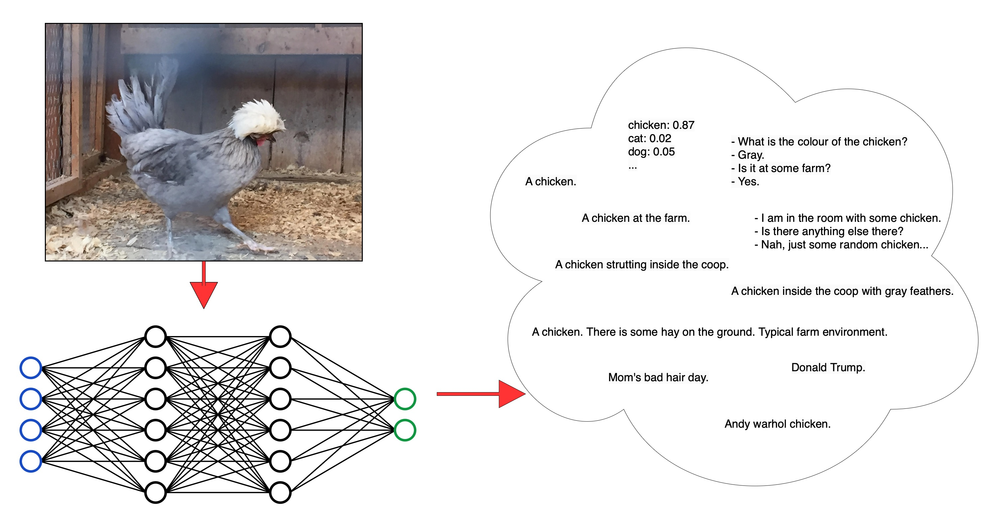
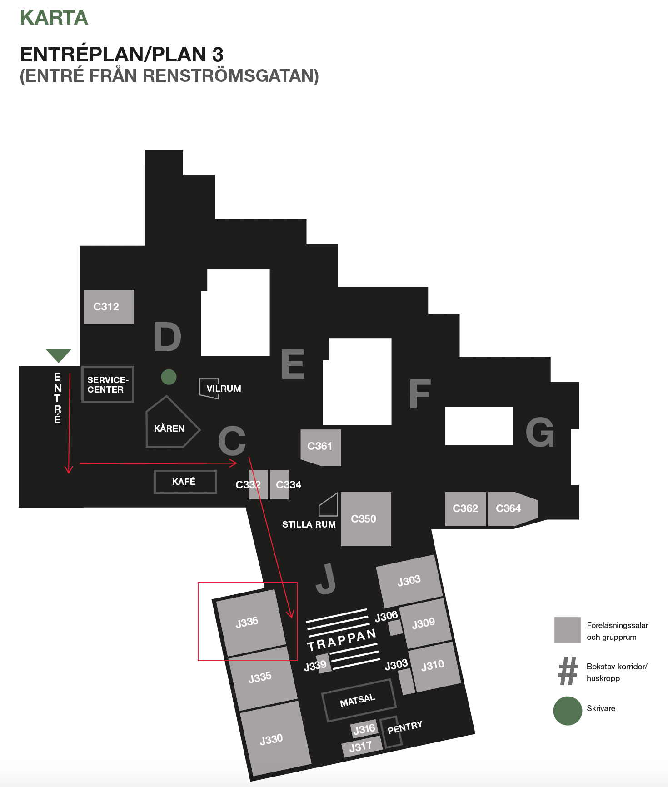

 
 

Organised by the Language and Perception research group at CLASP, University of Gothenburg, Gothenburg, Sweden.

Co-located with the doctoral thesis defence of Nikolai Ilinykh for Ph.D. in Computational Linguistics at the Faculty of Humanities, Department of Philosophy, Linguistics and Theory of Science, [official announcement](https://www.gu.se/en/event/nikolai-ilinykh-computational-models-of-language-and-vision-studies-of-neural-models-as-learners-of-multi-modal-knowledge).

* <b>Date</b>: 10th June 2024
* <b>Location</b>: Humanisten, [Department of Philosophy, Linguistics and Theory of Science (FLoV)](https://www.gu.se/flov/om-oss/kontakt), University of Gothenburg
* <b>Address</b>: Renströmsgatan 6, floor 3
* <b>Room</b>: J336

### Table of Contents
* [Workshop Description](#description)
* [Room Location](#map)
* [Programme](#programme)
* [Zoom Link](#zoomlink)
* [How to get to the venue](#howtoget)
* [Workshop Organisers](#workshop_organisers)
* [Acknowledgements](#acknowledgments)

### Workshop Description

We welcome you to the workshop on NLP and multi-modality!

Developments in AI and NLP in recent years have been substantial and have resulted in many computational models of language that are often claimed to achieve human-level performance across different tasks.
However, it is difficult to interpret such models and understand the processes behind the decisions they make.
While many models of language primarily learn from text, an important research direction is multi-modality, i.e., models working with texts, images, and other types of data like audio.
The attention on NLP and multi-modality is encouraging, but it also introduces numerous challenges and unresolved questions.
For instance, what exactly happens inside our NLP models?
Can we interpret their processes?
Perhaps, splitting a model into multiple, more interpretable parts is the way to go?
Other critical questions include the following: Do these models learn information from text and other modalities to a sufficient degree?
How should we represent this information to the models?
How do we evaluate these models, and what are the limitations of current benchmarks?
How much can we rely on automatic, human, or other types of evaluation?
Finally, what can we say about these models in terms of how "human-like" they are?

The workshop aims to bring together researchers who study computational models in both uni-modal (text-only) and multi-modal (text-and-image) domains.
It is a forum to discuss many different topics, including language-only and language-and-vision tasks, models, and evaluation methods.
We also welcome discussions about relevant insights from studies on human cognition.

The program consists of **6** talks given by the invited speakers.
The day after the workshop, we will have a doctoral thesis defense that everyone is welcome to attend!

### Zoom Link

[Zoom](https://gu-se.zoom.us/j/726750116)

### Programme

11:45 - 12:45: Lunch in [Näckrosen](https://www.hors.se/goteborg/17/6/restaurang-nackrosen/)

13:05: Welcome

13:15 - 13:45: [Jörg Tiedemann](https://researchportal.helsinki.fi/en/persons/jörg-tiedemann), University of Helsinki

  * **Title**: Releasing the MAMMOTH - a framework for modular NLP
  * **Abstract**: Neural language models have been grown in size and importance over the past years. We address two challenging aspects in the field of NLP: The support of a wide variety of languages and the runtime efficiency of such models. We focus on encoder-decoder models and modular architectures that balance between task-specific components and parameter sharing. In particular, we want to achieve effective cross-lingual transfer learning while keeping language-specific modules that can operate independently. The latter is important for efficient inference reducing computational costs and energy consumption at runtime, a crucial task for modern NLP. Our toolkit, MAMMOTH, is a flexible framework for training various types of modular architectures making it possible to systematically compare different approaches also beyond machine translation and single modalities.

13:45 - 14:15: [Ece Takmaz](https://ecekt.github.io), Utrecht University (online)

  * **Title**: Quantifying and Predicting the Variation in Human Signals during Visuo-Linguistic Processes
  * **Abstract**: There is an intricate relation between the properties of an image and how humans behave while describing the image. This behavior shows ample variation, as manifested in human signals such as eye movements and when humans start to describe the image. Despite the value of such signals of visuo-linguistic variation, they are virtually disregarded in the training of current pretrained models, which motivates further investigation. Using a corpus of image descriptions with concurrently collected eye-tracking data, we explore the nature of the variation in visuo-linguistic signals, and whether image representations encoded by pretrained vision encoders can capture such variation. I will also talk about another work where we use CLIP to quantify the degree of descriptiveness (how well an utterance describes an image in isolation) and discriminativeness (to what extent an utterance is effective in picking out a single image among similar images) of human referring utterances within multimodal dialogues. These works open up the possibility of using pretrained multimodal encoders to quantify patterns in human data and shed light on the underlying cognitive mechanisms, as well as identifying the shortcomings of such encoders.

14:15 - 14:45: [Carina Silberer](https://sites.google.com/view/carinasilberer/home), University of Stuttgart

  * **Title**: Multimodal Knowledge Learning of Actions and Everyday Procedures
  * **Abstract**: In order to instruct and interact with machines in everyday life using natural language, they need to be able to understand and model procedural tasks. This ability is therefore relevant for the fields of NLP, human-computer interaction and robotics, as well as for multimodal machine learning in general. Despite its relevance, multimodal (visual-linguistic, VL) modelling of procedures, i.e. the task of learning and understanding procedures from language and visual data, is still a challenge for current visual-linguistic models. This talk focuses on certain crucial aspects that underlie the modelling of everyday procedural tasks based on visual-linguistic data. In particular, I will present past and ongoing work on (i) the commonsense types of "events" and "actions" that have proven to be very difficult for current VL systems, (ii) affordance learning, i.e., modelling the actions that an object offers to individuals in a given environment, (iii) predicting the effects in object state change caused by performing an action on objects, and (iv) reasoning about the sequential aspect of procedures in terms of the relationship between individual steps to achieve a task goal, in particular the tasks of visual goal step inference and identifying optional and interchangeable steps.

14:45 - 15:00: Coffee break

15:00 - 15:30: [Desmond Elliott](https://elliottd.github.io), University of Copenhagen
   * **Title**: Some Recent Experiments in Retrieval-Augmented Image Captioning
   * **Abstract**: Retrieval-augmentation has proven useful in a wide-range of classification and generation tasks, and it is now powering the next generation of Large Language Models. In this talk, I will present recent research on applying retrieval-augmentation to the multimodal task of image caption generation. I will start by outlining how retrieval-augmentation can work in this task, and present a parameter-efficient image captioning model that can describe images from a variety of domains by hot-swapping the contents in the retrieval data store without retraining the model. Then I will describe two approaches to multilingual image captioning: one based on prompting an LLM without any training, the other based on supervised training with either multilingual or monolingual data. Finally, I will speak about our efforts to  understand and explain the success and failure modes of retrieval-augmented image captioning.

15:30 - 16:00: [Mario Guilianelli](https://glnmario.github.io), ETH Zürich (online)

  * **Title**: Measuring utterance uncertainty and predictability via simulation of contextually plausible alternatives
  * **Abstract**: Viewing linguistic communication as information transmission between cognitive agents, successful language production can be understood as an act of reducing the uncertainty over future states that a comprehender may be anticipating. When an individual utters a sentence, they narrow down the comprehender’s expectations, and they do so by an amount proportional to the contextual predictability of the utterance. I will discuss two recent studies that demonstrate how we can empirically estimate utterance uncertainty and predictability by simulating potential upcoming linguistic contributions using neural text generators. The first study introduces a statistical framework to quantify utterance uncertainty as production variability, and evaluates the alignment of language generators to the production variability observed in humans. We find that different types of production tasks exhibit distinct levels of lexical, syntactic, and semantic variability, and neural text generators generally achieve satisfactory calibration of uncertainty. In the second study, we use the previously introduced statistical framework to define a novel measure of utterance predictability, which we term information value. Information value quantifies predictability by measuring the distance from contextually plausible alternatives and offers advantages over traditional measures by disentangling various dimensions of uncertainty and being less influenced by surface form competition. Psycholinguistic experiments demonstrate that information value is a superior predictor of utterance acceptability in written and spoken dialogue compared to token-level surprisal aggregates, and that it complements surprisal in predicting eye-tracked reading times.

16:00 - 16:30: [Bill Noble](https://winobes.github.io), University of Gothenburg

  * **Title**: Effing the ineffable: Action and perception at the limits of language
  * **Abstract**: In formal semantics, truth conditional theories of meaning seek a relation between linguistic expressions and possible worlds (or states of affairs). Inferentialist approaches instead couch meaning as a relation between pairs of linguistic expressions. Akin to text-based distributional semantics, inferentialism appears to insulate linguistic theory from the need for a comprehensive world model. But this picture ignores the fact that language is part of the world and subject to change through interaction between linguistic agents. In several case studies, this talk will present formal accounts of action, perception and change as a lens through which to view multi-modality in computational semantics.

16:30: Closing

18:30: [Berzelius Bar & Matsal, menu](https://www.berzeliusbar.se/eventmeny/). All needs can be accomodated (e.g., gluten-free, allergies).

### Room Location 

<!--
### Invited speakers

* [Kristina Knaving](https://www.ri.se/en/person/kristina-knaving), RISE
   * Generative AI, like ChatGPT, DALL-E, and Midjourney, has recently changed our view of what AI can do by entering a traditionally human domain - creativity. What can we truly expect from AI, and what do we want to expect? Kristina will be doing a contemporary and future outlook on AI and generative AI in creative work and society as a whole. There are many opportunities, but also concerns and questions about ethics, democracy, and privacy.
   * *Kristina Knaving* is a senior researcher at RISE, and is responsible for the focus area "The Connected Individual". She has a background in human-computer interaction, visualization, and decision support. Her research focuses on the opportunities, risks, and ethical issues surrounding personal data and AI, and how new technologies affect individuals and society. 
* [Stefan Larsson](https://portal.research.lu.se/en/persons/stefan-larsson), Lund University
   * **The Perils of Being Normative: Towards a Socio-Legal Framework on Social Norms and Adaptive Technologies**
   * While recent progress has been made in several fields of data-intense AI-research, many applications have been shown to be prone to unintendedly reproduce social biases, sexism and stereotyping. As more of design-based, algorithmic or machine learning methodologies, here called adaptive technologies, become embedded in anything from commonly used software to robotics, there is a need for a developed understanding of what role social norms play in the interplay between human expressions and technology, particularly with regards to fairness. In this presentation, Larsson proposes a theoretical framework for the interplay between adaptive technologies and social norms in order to point to the often normative, non-neutral, aspects of developing and implementing adaptive technologies.
   * *Stefan Larsson* is a senior lecturer and Associate Professor in Technology and Social Change at Lund University, Sweden, Department of Technology and Society at LTH. He is a lawyer and socio-legal researcher that holds a PhD in Sociology of Law as well as a PhD in Spatial Planning. He leads a multidisciplinary research group on AI and Society, that studies the impact of AI-supported technologies in various domains, such as on consumer markets, in the public sector, for health, and social robotics.
* [Desmond Elliott](https://elliottd.github.io), University of Copenhagen
   * **Some Recent Experiments in Retrieval-Augmented Image Captioning**
   * Retrieval-augmentation has proven useful in a wide-range of classification and generation tasks, and it is now powering the next generation of Large Language Models. In this talk, I will present recent research on applying retrieval-augmentation to the multimodal task of image caption generation. I will start by outlining how retrieval-augmentation can work in this task, and present a parameter-efficient image captioning model that can describe images from a variety of domains by hot-swapping the contents in the retrieval data store without retraining the model. Then I will describe two approaches to multilingual image captioning: one based on prompting an LLM without any training, the other based on supervised training with either multilingual or monolingual data. Finally, I will speak about our efforts to  understand and explain the success and failure modes of retrieval-augmented image captioning.
-->

<!--
### Instructions for presenters

* Keynote talks will be 45 minutes.
  * 10 minutes of these are intended for questions.
* Lightining talks will be 10 minutes each.
  * After each presentation we will take questions during the change of speakers
  * After the lightning talks there will be 10 minutes for questions for all speakers.
* We hope that additional discussions will take place during the group discussion in the second half of the workshop.

To enable quicker speaker switching, please upload your presentations slides before the talk as pdf to [this shared folder](https://www.dobnik.net/cloud/s/dwn7nmY68aEjatK).
* The folder as well as the slides will be accessible from the presentation computer in the room.
* If you would like to update your slides, simply upload a new version with the same filename.
* Please name your slides as lastname_title.pdf to make it easier for us to know which presentation belongs to who.

If you have have any additional presentation requirements, e.g. slides that are not in pdf, playing video and sound, etc., please [contact Ricardo](mailto:ricardo.munoz.sanchez@gu.se) in advance.
-->

### How to get to the venue

#### Conference Venue

The Humanisten building is located at Näckrosdammen, near the tram/bus stop Korsvägen. The facility is handicap-accessible and environmentally certified.

#### Train station

The Gothenburg Centralstation is located approximately 2km from the Humanisten building; you can either choose to walk or take the tram number 2 or 4 (direction: Mölndal) and get off at tram stop Korsvägen. For timetables and tickets, we recommend the app Västtrafik To Go, a simple way to purchase tickets with your mobile phone.

#### Airport

Landvetter Airport is located 25km from Gothenburg. The airport shuttle service to Gothenburg city departs about every 15 minutes and is very convenient. Get off at bus stop Korsvägen for the conference venue or Nils Ericson Terminalen (Göteborg C) for Gothenburg city. A one-way ticket costs 119 SEK. For schedule and ticket information, please see [here](https://www.flygbussarna.se/en/landvetter). 

#### Taxi

The journey from the airport to the city takes 30 minutes and costs around 700 SEK. We recommend [Taxi Göteborg](https://www.taxigoteborg.se/en/booking).

#### About Sweden

Note that the use of cash is rare in Sweden. Payments by card are preferred and possible everywhere, with cash not even accepted in many stores. [More information is here](https://sweden.se/life/society/a-cashless-society)

### Workshop Organisers

  - [Nikolai Ilinykh](https://www.gu.se/en/about/find-staff/nikolaiilinykh), University of Gothenburg (contact person)
  - [Simon Dobnik](https://www.gu.se/en/about/find-staff/simondobnik), University of Gothenburg

### Acknowledgements

We are grateful for the financial support from:

  - [Department of Philosophy, Linguistics and Theory of Science (FLoV)](https://www.gu.se/flov/), University of Gothenburg
  - [Centre for Linguistic Theory and Studies in Probability](https://gu-clasp.github.io)

Image from [Reddit](https://www.reddit.com/r/mildlyinteresting/comments/6s98n8/this_chicken_has_the_same_hair_style_as_andy/)
